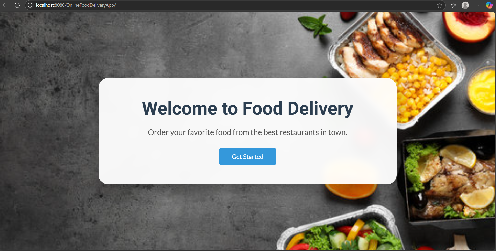
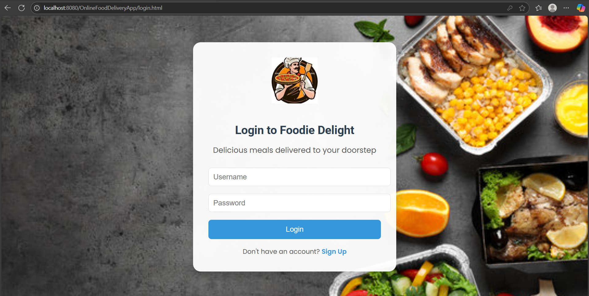
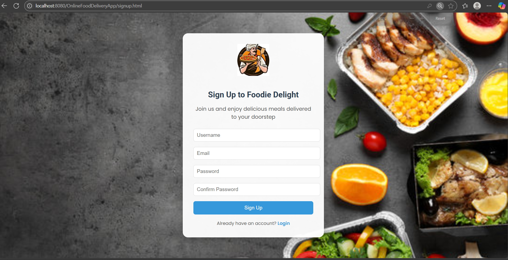
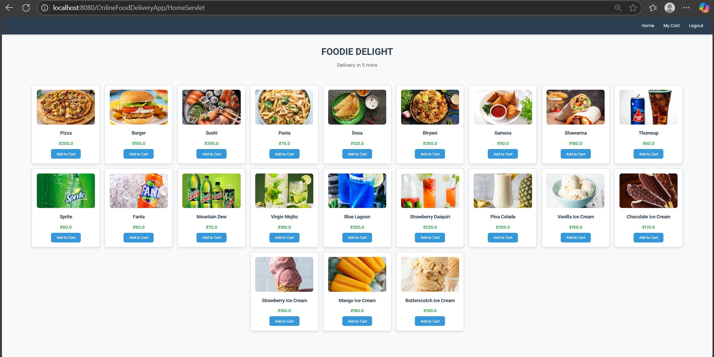
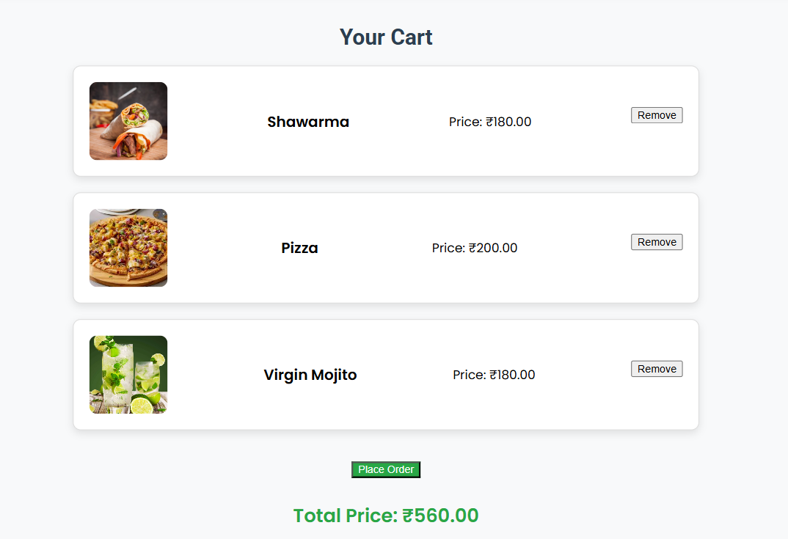

# 🍕 Online Food Delivery Management System

> A full-stack **Java Web Application** that allows users to explore menus, order food online, and manage their cart — all in one place! Built with JSP, Servlets, and MySQL.

---

## 📌 Project Overview

This project helps users:

- 👤 Create an account  
- 🔐 Log in securely  
- 🍔 Browse food items  
- 🛒 Add items to cart  
- ✅ Place orders  
- 🧾 View order confirmation  

All actions are backed by **Java Servlets** and stored in a **MySQL** database.

---

## 🖼️ Screenshots & Walkthrough

Here's a visual journey through the app:

### 🏠 Home Page (`index.html`)
  
📝 **Description:**  
A clean welcome screen featuring the app’s name and a **Get Started** button. It leads users to log in or register and start their food journey!

---

### 🔐 Login Page (`login.html`)
  
📝 **Description:**  
Existing users log in here with username and password. The page includes a link to sign up for new users.

---

### 📝 Sign-Up Page (`signup.html`)
  
📝 **Description:**  
New users can register with a username, email, and password. Their details are stored in the `users` table of the MySQL database.

---

### 🍱 Food Items Page (`home1.jsp`)
  
📝 **Description:**  
Once logged in, users can see a delicious menu pulled from the `food_items` table. Each item has an image, name, price, and **Add to Cart** button.

---

### 🛒 My Cart Page (`mycart.jsp`)
  
📝 **Description:**  
View all added items, remove items, and check total price. A **Place Order** button at the bottom finalizes the purchase.

---

### ✅ Order Confirmation Page
  
📝 **Description:**  
A friendly message confirming the order. All order data is saved in the `orders` table. Users can return to shopping or log out.

---

### 🔓 Logout Page
  
📝 **Description:**  
Once logged out, the session ends and the user is redirected to the homepage with a success alert: **"Logout Successful!"**

---

## ⚙️ Tech Stack

| Layer        | Technology               |
|--------------|---------------------------|
| 👩‍🎨 Frontend   | HTML, CSS, JSP            |
| 🧠 Backend    | Java Servlets (Jakarta)  |
| 🗃️ Database    | MySQL                     |
| 🔥 Server     | Apache Tomcat             |
| 💻 IDE        | NetBeans                  |

---

## 🗂️ Project Structure

OnlineFoodDeliveryApp/
├── nbproject/ # NetBeans config
├── src/ # Java servlets
├── web/ # JSP, HTML, images
├── screenshots/ # App UI screenshots
├── .gitignore
└── README.md

---

## 🚀 How to Run the Project

1. **Clone the repository**
```bash
git clone https://github.com/YourUsername/OnlineFoodDeliveryApp.git
cd OnlineFoodDeliveryApp
Open the project in NetBeans

Set up the MySQL database

Create a DB named food_delivery

Add tables: users, food_items, cart, orders

Run the project

Deploy it to Apache Tomcat

Visit: http://localhost:8080/OnlineFoodDeliveryApp

🧪 User Flow
🏠 Welcome screen → click Get Started

🔐 Log in or 📝 Sign up

🍽️ Browse food menu

➕ Add items to cart

🛍️ View cart & place order

✅ Receive order confirmation

🔓 Logout when done

🙋 Authors
👩‍💻 Abhinaya Chalamalasetti


📜 License
This project is made for academic demonstration under VR Siddhartha Engineering College. Not for commercial use.

✨ Feedback & Contributions
If you like this project or want to contribute, feel free to fork, ⭐ star, or submit a pull request.
Let’s make food ordering smarter together 🍽️💻


